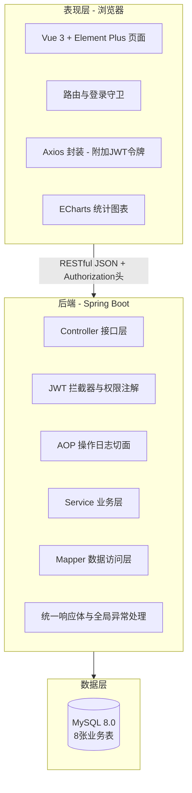

# 养老机构管理系统 —— 系统设计文档

> 版本：v1.0　｜　日期：2026-08-16　｜　配套：《需求分析文档.md》《API接口文档.md》、init.sql

---

## 1. 总体架构

### 1.1 架构设计

系统采用**前后端分离的 B/S 三层架构**：

```
┌─────────────────────────────────────────────┐
│ 表现层：Vue 3 + Element Plus（浏览器）        │
│  页面 / 路由 / Pinia 登录态 / Axios / ECharts │
├─────────────────────────────────────────────┤
│ 接口层：RESTful API（JSON）                  │
│  JWT 拦截器鉴权 → @RequireRole 权限控制      │
│  AOP 操作日志 → 统一响应/全局异常             │
├─────────────────────────────────────────────┤
│ 业务层：Spring Boot Service（事务）          │
│  老人 / 护理 / 健康 / 探访 / 留言 / 统计      │
├─────────────────────────────────────────────┤
│ 数据层：MyBatis-Plus（Mapper）→ MySQL 8.0    │
└─────────────────────────────────────────────┘
```

### 1.2 技术选型

| 层次 | 技术 | 选型理由 |
|------|------|----------|
| 后端框架 | Spring Boot 3.x | 生态成熟、自动化配置，长期维护，学习资料丰富 |
| 持久层 | MyBatis-Plus | 通用 CRUD 开箱即用，分页插件成熟 |
| 数据库 | MySQL 8.0 | 免费、主流，B/S 项目标准选择 |
| 认证 | JWT（JJWT 或 Hutool） | 无状态令牌，服务端不存会话 |
| 导出 | EasyExcel | 简化 Excel 生成，避免 POI 手写样式 |
| 前端框架 | Vue 3 + Vite | 组合式 API 简洁，构建快 |
| UI | Element Plus | 表格/表单/弹窗组件完整 |
| 可视化 | ECharts | 折线图、饼图支持好 |
| 状态管理 | Pinia | Vue 3 官方推荐，存登录态 |
| 构建 | Maven / npm | 标准工程实践 |

### 1.3 项目结构

**后端（Maven，包名 com.eldercare）**

```
src/main/java/com/eldercare/
├── common/          # 统一响应 Result、错误码、BusinessException、全局异常处理
├── config/          # WebConfig（拦截器注册、CORS）、MybatisPlusConfig（分页插件）
├── security/        # JwtUtil、JwtInterceptor、RequireRole 注解、RoleAccessChecker
├── aspect/          # LogAspect（操作日志切面）
├── controller/      # AuthController、UserController、LogController、ElderController、
│                    #   CareRecordController、HealthRecordController、MedicinePlanController、
│                    #   VisitController、MessageController、StatsController
├── service/         # 业务接口
│   └── impl/        # 业务实现（事务注解 @Transactional）
├── mapper/          # MyBatis-Plus Mapper 接口（统计用 @Select 注解 SQL）
├── entity/          # 用户/老人/护理/体征/用药/探访/留言/日志 实体
└── dto/ vo/         # 请求参数封装、视图对象
```

**前端（Vite 工程）**

```
src/
├── api/             # login.js、user.js、elder.js、care.js、health.js、visit.js、message.js、stats.js
├── utils/request.js # Axios 实例（请求拦截附加 token，响应拦截处理 401/403）
├── router/index.js  # 路由与守卫（未登录跳登录页，管理员路由权限）
├── store/user.js    # Pinia：token、用户信息
├── views/
│   ├── login/       # 登录页
│   ├── dashboard/   # 首页看板（ECharts）
│   ├── sys/         # UserManage.vue、LogManage.vue
│   ├── elder/       # ElderList.vue、ElderEdit.vue
│   ├── care/        # CareRecordList.vue
│   ├── health/      # HealthRecordList.vue、MedicinePlan.vue、MedicineTask.vue
│   ├── visit/       # VisitList.vue（家属）/ VisitAudit.vue
│   └── message/     # MessageList.vue
└── components/      # 通用组件（搜索栏、导出按钮等）
```

---

## 2. 后端设计

### 2.1 统一响应与全局异常

- 统一响应体 `Result<T>`：`{ code, message, data }`；
- 业务异常 `BusinessException`（携带错误码），由 `@RestControllerAdvice` 全局捕获转换为 JSON；
- 常见异常映射：401 未登录、403 无权限、500 未捕获异常；
- 参数校验：Bean Validation（@NotBlank 等）在 Controller 参数上使用，校验失败统一返回 400。

### 2.2 JWT 认证与权限控制

**登录流程**：登录接口校验账号密码（BCrypt 校验）→ 签发 JWT（payload 含 userId、username、role，有效期 24h）→ 前端保存。

**鉴权链路**：

1. `JwtInterceptor`（实现 HandlerInterceptor）注册到 `/api/**`，放行 `/api/auth/login`；
2. preHandle 解析 `Authorization: Bearer <token>` → JwtUtil 校验签名与过期时间 → 从 token 取出 userId/role 存入 ThreadLocal（`UserContext`）；
3. 解析目标 HandlerMethod 上的 `@RequireRole(role = {"admin", "nurse"})` 注解，当前用户角色不在允许列表则抛 403；
4. 业务层做**数据级隔离**：家属角色查询老人数据时强制拼接 `elder.family_id = 当前用户id`。

### 2.3 操作日志（AOP）

- 自定义注解 `@Log(operation = "新增老人")` 标注在 Controller 写操作方法上；
- `LogAspect` 用 `@Around` 拦截：记录操作人（UserContext）、操作描述、请求方法+路径、请求参数（JSON 截断 500 字符）、IP；
- 异常时不记录（或记录为失败，可根据需要）；日志异步写入不阻塞业务（可简单同步写）；
- 日志只增不删，管理员在日志页查询。

### 2.4 用药任务闭环（惰性生成算法）

表 `medicine_plan` 一行 = 一位老人某一天某一个时间点的一次用药任务。核心逻辑全部在 Service：

```
查询当日任务(老人, 日期):
  1. 逾期扫描：UPDATE medicine_plan
       SET status = 2
       WHERE elder_id = ? AND plan_date < 日期 AND status = 0
  2. 取当日任务：SELECT * FROM medicine_plan
       WHERE elder_id = ? AND plan_date = 日期 ORDER BY plan_time
  3. 若为空：取最近一天的任务行（plan_date 小于日期 的最大值），
     复制一份（plan_date = 日期, status = 0, confirm_time = NULL）插入
  4. 返回当日任务
```

- **录入计划**：护理人员填药名、剂量、多个时间点 → 为"当天"每个时间点插入一行；
- **确认执行**：`PUT /medicine-tasks/{id}/complete` 置 status=1 并记录 confirm_time；
- **停用计划**：删除该老人该药 `plan_date >= 今天` 的任务行，同时把历史行 `disabled` 置 1。只删行会导致次日"按需生成"逻辑从历史行重新复制出新任务，故用 `disabled` 标记阻断延续（历史行保留，作为档案）；
- 该算法简单可靠，不依赖定时任务，答辩可重点讲解。

### 2.5 Excel 导出（EasyExcel）

- Controller 方法直接向 `HttpServletResponse` 输出：
  1. 设置响应头 `Content-Disposition: attachment; filename=xxx.xlsx`（UTF-8 编码文件名）；
  2. `EasyExcel.write(response.getOutputStream(), 导出VO.class).sheet("数据").doWrite(list)`；
  3. 查询逻辑复用列表查询的筛选条件；
- 前端用 `responseType: 'blob'` 接收并触发浏览器下载。

### 2.6 家属数据隔离

- family 角色的所有业务接口：先取当前用户 → 查关联 elder（`elder_info.family_id = userId`）；
- 探访/留言接口自动把 familyId 设为当前用户；列表接口强制过滤；
- elder 详情、健康档案等只读接口校验归属，越权返回 403。

### 2.7 统计接口实现

- 入住率：`COUNT(status=1) / COUNT(*)`；
- 年龄分布：`YEAR(CURDATE()) - YEAR(birthday)` 分区间 `GROUP BY`（Case When）；
- 近 30 天趋势：按天 `GROUP BY DATE(care_time)`，无数据日期前端补 0；
- 体征趋势：按日期取每次记录（或当日最后一次），前端画折线图。

---

## 3. 数据库设计

### 3.1 设计原则

1. 以业务对象为表边界，**小数据用字段、大数据用表**：角色、房间、用药任务不单独建表；
2. 所有表使用 InnoDB、utf8mb4；
3. 状态字段用 TINYINT，字典值统一约定（见需求文档 5.2）；
4. 外键关系不建物理外键，由业务层保证（毕设惯例，便于测试数据操作）；
5. 字段命名统一 snake_case，时间字段 DATETIME。

### 3.2 表清单（8 张）

| 表名 | 说明 |
|------|------|
| sys_user | 用户（admin/nurse/family 三角色） |
| elder_info | 老人档案（含房间床位、入住状态、关联家属） |
| care_record | 护理记录（护理计划与执行记录合一） |
| health_record | 健康体征记录 |
| medicine_plan | 用药计划/用药任务（一行=某天某时间点一次任务，任务状态在此表） |
| visit_appointment | 探访预约与审核 |
| message | 留言与回复 |
| sys_log | 操作日志 |

### 3.3 核心表字段设计

**sys_user**

| 字段 | 类型 | 约束 | 说明 |
|------|------|------|------|
| id | BIGINT | PK, AUTO_INCREMENT | 主键 |
| username | VARCHAR(50) | NOT NULL, UNIQUE | 用户名 |
| password | VARCHAR(100) | NOT NULL | BCrypt 密文 |
| real_name | VARCHAR(50) | | 姓名 |
| role | VARCHAR(20) | NOT NULL | admin/nurse/family |
| phone | VARCHAR(20) | | 手机号 |
| status | TINYINT | DEFAULT 1 | 1 启用 / 0 禁用 |
| create_time | DATETIME | DEFAULT NOW() | 创建时间 |

**elder_info**（业务主表）

| 字段 | 类型 | 约束 | 说明 |
|------|------|------|------|
| id | BIGINT | PK | 主键 |
| name | VARCHAR(50) | NOT NULL | 姓名 |
| gender | TINYINT | NOT NULL | 1 男 / 2 女 |
| birthday | DATE | | 出生日期 |
| id_card | VARCHAR(18) | UNIQUE | 身份证号 |
| phone | VARCHAR(20) | | 联系电话 |
| emergency_contact | VARCHAR(50) | | 紧急联系人 |
| emergency_phone | VARCHAR(20) | | 紧急联系电话 |
| room_no | VARCHAR(20) | | 房间号 |
| bed_no | VARCHAR(20) | | 床位号 |
| health_summary | VARCHAR(500) | | 健康概况 |
| status | TINYINT | DEFAULT 1 | 1 在住 / 0 已退住 |
| checkin_time | DATE | | 入住日期 |
| checkout_time | DATE | | 退住日期 |
| family_id | BIGINT | | 关联家属账号 sys_user.id |
| create_time | DATETIME | DEFAULT NOW() | 创建时间 |

索引：idx_family_id(family_id)、idx_status(status)

**care_record**

| 字段 | 类型 | 说明 |
|------|------|------|
| id | BIGINT PK | 主键 |
| elder_id | BIGINT NOT NULL | 老人 ID |
| plan_name | VARCHAR(50) | 护理项目（如翻身、喂饭） |
| plan_frequency | VARCHAR(50) | 频次说明 |
| care_content | VARCHAR(500) | 护理内容 |
| nurse_id | BIGINT | 执行护理人员 |
| care_time | DATETIME | 执行时间 |
| remark | VARCHAR(200) | 交接备注 |
| create_time | DATETIME | 创建时间 |

索引：idx_elder_time(elder_id, care_time)

**health_record**

| 字段 | 类型 | 说明 |
|------|------|------|
| id | BIGINT PK | 主键 |
| elder_id | BIGINT NOT NULL | 老人 ID |
| blood_pressure | VARCHAR(20) | 血压（如 128/82） |
| heart_rate | INT | 心率（次/分） |
| temperature | DECIMAL(3,1) | 体温（℃） |
| blood_sugar | DECIMAL(4,1) | 血糖（mmol/L） |
| record_time | DATETIME | 测量时间 |
| recorder_id | BIGINT | 录入人 |
| remark | VARCHAR(200) | 备注 |
| create_time | DATETIME | 创建时间 |

索引：idx_elder_time(elder_id, record_time)

**medicine_plan**

| 字段 | 类型 | 说明 |
|------|------|------|
| id | BIGINT PK | 主键 |
| elder_id | BIGINT NOT NULL | 老人 ID |
| medicine_name | VARCHAR(50) NOT NULL | 药名 |
| dosage | VARCHAR(50) | 剂量（如每次 1 片） |
| plan_date | DATE NOT NULL | 服药日期 |
| plan_time | TIME NOT NULL | 服药时间点 |
| status | TINYINT DEFAULT 0 | 0 待执行 / 1 已执行 / 2 已逾期 |
| confirm_time | DATETIME | 确认执行时间 |
| disabled | TINYINT DEFAULT 0 | 0 正常 / 1 已停用（停用标记，防止次日按需生成逻辑延续已停方案） |
| create_time | DATETIME | 创建时间 |

索引：idx_elder_date(elder_id, plan_date)、idx_date_status(plan_date, status)

**visit_appointment**

| 字段 | 类型 | 说明 |
|------|------|------|
| id | BIGINT PK | 主键 |
| elder_id | BIGINT NOT NULL | 老人 ID |
| family_id | BIGINT NOT NULL | 预约家属用户 ID |
| visit_date | DATE NOT NULL | 探访日期 |
| visit_time | VARCHAR(50) | 探访时段 |
| persons | INT DEFAULT 1 | 探访人数 |
| status | TINYINT DEFAULT 0 | 0 待审核 / 1 已通过 / 2 已驳回 / 3 已完成 |
| audit_remark | VARCHAR(200) | 审核意见（驳回必填） |
| create_time | DATETIME | 创建时间 |

索引：idx_status(status)、idx_elder(elder_id)

**message**

| 字段 | 类型 | 说明 |
|------|------|------|
| id | BIGINT PK | 主键 |
| elder_id | BIGINT NOT NULL | 老人 ID |
| family_id | BIGINT NOT NULL | 家属用户 ID |
| content | VARCHAR(500) NOT NULL | 留言内容 |
| reply | VARCHAR(500) | 回复内容 |
| reply_time | DATETIME | 回复时间 |
| status | TINYINT DEFAULT 0 | 0 未回复 / 1 已回复 |
| create_time | DATETIME | 创建时间 |

索引：idx_status(status)

**sys_log**

| 字段 | 类型 | 说明 |
|------|------|------|
| id | BIGINT PK | 主键 |
| user_id | BIGINT | 操作人用户 ID |
| username | VARCHAR(50) | 操作人用户名 |
| operation | VARCHAR(100) | 操作描述 |
| method | VARCHAR(100) | 请求方法 + 路径 |
| params | VARCHAR(500) | 请求参数（截断） |
| ip | VARCHAR(50) | 客户端 IP |
| create_time | DATETIME | 操作时间 |

索引：idx_create_time(create_time)

### 3.4 表关系

```
sys_user(家属) 1 ── 1 elder_info(family_id)
elder_info 1 ── N care_record / health_record / medicine_plan / visit_appointment / message
sys_user(护理) 1 ── N care_record(nurse_id) / health_record(recorder_id)
sys_log N ── 1 sys_user(user_id)
```

完整 DDL 与演示数据见 `init.sql`（可直接导入 MySQL）。

---

## 4. 前端设计

### 4.1 页面清单

| 页面 | 路由 | 角色 |
|------|------|------|
| 登录页 | /login | 全部 |
| 首页看板 | /dashboard | admin |
| 用户管理 | /sys/users | admin |
| 操作日志 | /sys/logs | admin |
| 老人列表/编辑 | /elders | admin、nurse |
| 护理记录 | /care-record | admin、nurse（family 只读列表） |
| 体征记录 | /health-record | admin、nurse、family |
| 用药计划 | /medicine-plan | admin、nurse |
| 用药任务 | /medicine-task | admin、nurse |
| 探访（家属） | /visit | family |
| 探访审核 | /visit-audit | admin、nurse |
| 留言 | /message | 全部 |

### 4.2 路由与守卫

- 路由 `meta.roles` 声明可访问角色；`router.beforeEach` 校验登录态（无 token 跳 /login）；
- 角色不匹配跳 403 页；菜单按角色动态过滤显示。

### 4.3 Axios 封装（utils/request.js）

- 请求拦截器：从 Pinia 取 token，附加 `Authorization` 头；
- 响应拦截器：code === 200 返回 data；401 清空登录态跳登录页；403 提示无权限；其他提示 message 并 reject。

### 4.4 看板图表（ECharts）

- 年龄分布：饼图（`stats/age-distribution`）；
- 近 30 天护理/探访趋势：双折线图（`stats/activity-trend`）；
- 体征趋势：折线图（`stats/elder/{id}/health-trend`），血压按收缩压/舒张压拆两条线；
- 图表容器设置固定高度，窗口变化时 resize。

---

## 5. 安全与质量要点

| 关注点 | 措施 |
|--------|------|
| 密码安全 | BCrypt 加盐存储，修改密码需验证原密码 |
| 认证安全 | JWT 24h 过期；实现统一拦截；登录失败统一提示（不暴露用户是否存在） |
| 授权安全 | 接口级 @RequireRole + 家属数据归属校验（防止水平越权） |
| 注入防护 | 全部使用 MyBatis-Plus 参数化 SQL，统计接口 @Select 使用 ${} 处做白名单校验 |
| 参数安全 | Bean Validation 校验必填与长度；日志参数截断防超长 |
| 前端安全 | 角色菜单过滤；Axios 统一错误处理；表单禁用 XSS 高危输入（如 `<script>` 前端转义） |
| 状态一致性 | 写操作 @Transactional；老人退住时校验关联数据 |

---

## 6. 部署与运行

### 6.1 环境要求

- MySQL 8.0（本地或服务器）
- JDK 17+（Spring Boot 3.x 要求）
- Node 16+（仅开发构建需要，前端可构建后由后端/静态服务器托管）

### 6.2 启动步骤

1. 创建数据库：`CREATE DATABASE elder_care DEFAULT CHARACTER SET utf8mb4;`
2. 导入表结构：`mysql -u root -p elder_care < init.sql`
3. 后端：修改 `application.yml` 数据源和 JWT 密钥 → `mvn spring-boot:run`（端口 8080）
4. 前端：`npm install` → `npm run dev`（开发环境配置 Vite 代理 `/api` → `http://localhost:8080`）
5. 访问 `http://localhost:8081`（Vite 默认端口），默认管理员 `admin / 123456`

### 6.3 演示数据

init.sql 内置演示数据：管理员 1、护理人员 2、家属 2、老人 5（含在住/已退住）、护理记录、体征记录、用药任务、探访预约、留言、操作日志若干，便于开发联调与答辩演示。

---

## 7. 附录：系统架构图与 ER 图（mermaid 源码）

> 渲染方法：Typora / VS Code（Markdown Preview Mermaid Support 插件）/ mermaid.live 粘贴渲染，导出 PNG 后插入论文。

### 7.1 系统架构图



### 7.2 ER 图
    sys_user ||--o| elder_info : "family_id 家属关联"
    elder_info ||--o{ care_record : "护理"
    elder_info ||--o{ health_record : "体征"
    elder_info ||--o{ medicine_plan : "用药"
    elder_info ||--o{ visit_appointment : "探访"
    elder_info ||--o{ message : "留言"
    sys_user ||--o{ care_record : "nurse_id 执行人"
    sys_user ||--o{ sys_log : "操作人"

    sys_user {
        bigint id PK
        varchar username UK
        varchar password
        varchar role
        tinyint status
    }
    elder_info {
        bigint id PK
        varchar name
        varchar id_card UK
        varchar room_no
        varchar bed_no
        tinyint status
        bigint family_id FK
    }
    care_record {
        bigint id PK
        bigint elder_id FK
        varchar plan_name
        bigint nurse_id FK
        datetime care_time
    }
    health_record {
        bigint id PK
        bigint elder_id FK
        varchar blood_pressure
        int heart_rate
        decimal temperature
        decimal blood_sugar
    }
    medicine_plan {
        bigint id PK
        bigint elder_id FK
        varchar medicine_name
        date plan_date
        time plan_time
        tinyint status
    }
    visit_appointment {
        bigint id PK
        bigint elder_id FK
        bigint family_id FK
        date visit_date
        tinyint status
    }
    message {
        bigint id PK
        bigint elder_id FK
        bigint family_id FK
        varchar content
        varchar reply
    }
    sys_log {
        bigint id PK
        bigint user_id FK
        varchar operation
        varchar method
    }
```