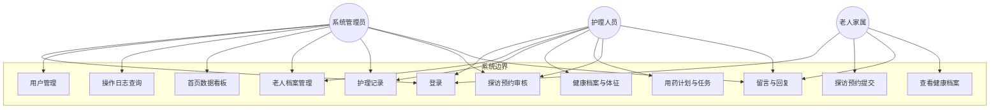
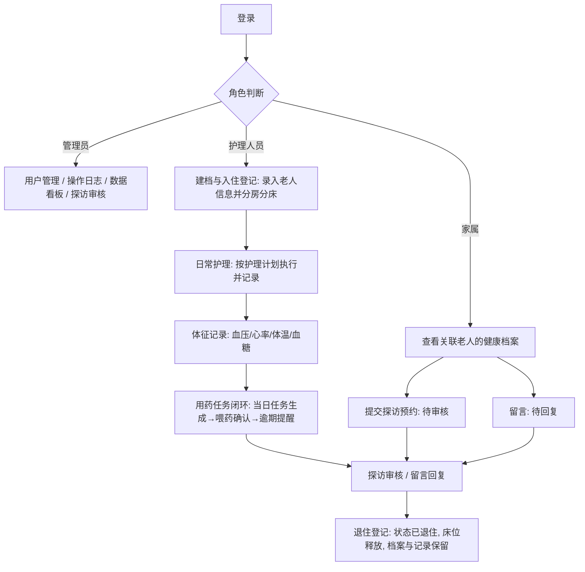
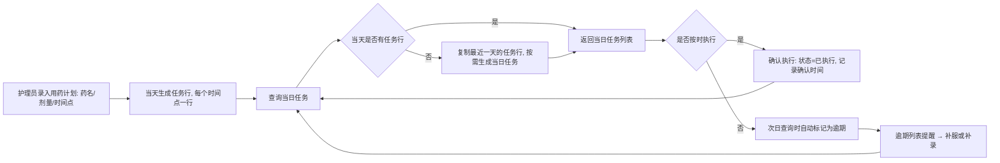

# 养老机构管理系统 —— 需求分析文档

> 项目名称：基于 Spring Boot 的养老机构管理系统的设计与实现
> 版本：v1.0　｜　日期：2026-08-16　｜　配套：《开题报告》同目录、《API接口文档.md》《系统设计文档.md》

---

## 1. 引言

### 1.1 编写目的与范围

本文档描述养老机构管理系统的用户角色、功能需求、数据需求与非功能需求，作为系统设计、开发实现与测试验收的依据。系统面向中小型养老机构，覆盖老人档案、日常护理、健康管理、探访沟通等核心业务。

### 1.2 术语定义

| 术语 | 含义 |
|------|------|
| B/S 架构 | 浏览器/服务器架构，用户通过浏览器访问系统 |
| JWT | JSON Web Token，无状态登录认证令牌 |
| BCrypt | 密码散列算法，用于用户密码加密存储 |
| CRUD | 增（Create）、查（Read）、改（Update）、删（Delete）操作 |
| 体征 | 血压、心率、体温、血糖等生理指标 |
| 家属账号 | 老人家属使用的系统账号，一个老人关联一个家属账号 |

### 1.3 参考资料

- 《"十四五"国家老龄事业发展和养老服务体系规划》
- 《2023 年国民经济和社会发展统计公报》
- 学校《毕业设计（论文）格式》与开题报告

---

## 2. 系统总体概述

### 2.1 建设目标

构建一个基于 B/S 架构的养老机构管理系统，实现：
1. 老人档案、护理、健康、探访等核心业务的信息化管理，替代手工记录与电子表格；
2. 机构管理者、护理人员、老人家属三类角色分权限协同使用；
3. 用药任务闭环管控与健康/运营数据可视化，支撑服务质量与管理决策；
4. 系统共分为五个功能模块：系统管理、老人档案管理、护理管理、健康管理、探访管理，各模块功能需求详见第 3 章。

### 2.2 用户角色

| 角色 | 职责 | 系统权限 |
|------|------|----------|
| 系统管理员（admin） | 系统运维与全局管理 | 全部功能：用户管理、操作日志、统计看板、业务数据维护 |
| 护理人员（nurse） | 日常照护业务执行 | 老人档案、护理记录、健康数据维护、探访审批；无用户管理权限 |
| 老人家属（family） | 了解老人状况、参与照护沟通 | 查看关联老人的健康档案、提交探访预约与留言；只读，不可修改业务数据 |

### 2.3 运行环境

| 环境 | 要求 |
|------|------|
| 服务端 | Windows/Linux，JDK 17+，MySQL 8.0 |
| 客户端 | 主流浏览器（Chrome、Edge 等） |
| 开发环境 | IDEA / VSCode、Node 16+、Maven 3.6+ |

### 2.4 系统范围与边界

**范围内**：5 个功能模块（系统管理、老人档案管理、护理管理、健康管理、探访管理）。
**范围外**（本期不实现）：费用缴纳与管理、员工排班与考勤、消息推送（短信/微信）、移动端 App、财务统计。

---

## 3. 功能需求

> 功能点编号规则：FR-模块序号-功能序号。优先级：高 = 必须实现；中 = 建议实现；低 = 有精力再实现。

### 3.1 系统管理模块

| 编号 | 功能点 | 描述 | 角色 | 优先级 |
|------|--------|------|------|--------|
| FR-1-1 | 登录 | 输入用户名密码登录，签发 JWT 令牌；密码错误提示；未登录访问接口返回 401 | 全部 | 高 |
| FR-1-2 | 获取当前用户信息 | 根据令牌返回当前用户信息与角色 | 全部 | 高 |
| FR-1-3 | 修改密码 | 验证原密码后修改，BCrypt 加密存储 | 全部 | 高 |
| FR-1-4 | 用户管理 | 系统用户的增删改查；用户名唯一；新增/编辑用户时可设置角色与启用状态 | 管理员 | 高 |
| FR-1-5 | 重置密码 | 管理员将指定用户密码重置为默认密码 | 管理员 | 中 |
| FR-1-6 | 操作日志查询 | 分页查看操作日志（操作人、操作描述、接口、IP、时间），支持按操作人与时间筛选 | 管理员 | 高 |
| FR-1-7 | 首页数据看板 | 展示入住率、老人数量、年龄分布、近 30 天护理/探访数量、健康趋势图表 | 管理员 | 高 |

### 3.2 老人档案管理模块

| 编号 | 功能点 | 描述 | 角色 | 优先级 |
|------|--------|------|------|--------|
| FR-2-1 | 老人列表 | 分页查询老人信息，支持按姓名、房间号、状态筛选 | 管理员、护理 | 高 |
| FR-2-2 | 老人新增/编辑 | 维护老人基本信息与紧急联系人、健康概况；身份证号唯一 | 管理员、护理 | 高 |
| FR-2-3 | 老人删除 | 删除老人档案（仅允许删除未创建业务数据的记录） | 管理员 | 中 |
| FR-2-4 | 入住登记 | 登记入住日期并分配房间/床位；入住后状态为"在住" | 管理员、护理 | 高 |
| FR-2-5 | 退住登记 | 登记退住日期，状态改为"已退住"，释放房间床位 | 管理员、护理 | 高 |
| FR-2-6 | 名单导出 | 将符合条件的老人名单导出为 Excel（.xlsx）文件 | 管理员、护理 | 中 |

### 3.3 护理管理模块

| 编号 | 功能点 | 描述 | 角色 | 优先级 |
|------|--------|------|------|--------|
| FR-3-1 | 护理记录列表 | 按老人、护理项目、时间范围分页查询护理记录 | 管理员、护理 | 高 |
| FR-3-2 | 护理记录新增 | 记录护理项目、护理内容、执行时间；自动记录操作人（护理人员） | 护理 | 高 |
| FR-3-3 | 护理记录修改/删除 | 修改或删除本人当日的记录（业务上建议限制：仅可修改/删除当天记录） | 护理 | 中 |
| FR-3-4 | 交接班记录 | 护理记录中填写备注，作为交接班信息（不单独建模块） | 护理 | 低 |
| FR-3-5 | 护理记录导出 | 将查询结果导出为 Excel 文件 | 管理员、护理 | 中 |

### 3.4 健康管理模块

| 编号 | 功能点 | 描述 | 角色 | 优先级 |
|------|--------|------|------|--------|
| FR-4-1 | 健康档案查询/编辑 | 维护老人病史、过敏史、用药禁忌等健康概况 | 护理；家属只读 | 高 |
| FR-4-2 | 体征记录 | 录入血压、心率、体温、血糖与测量时间 | 护理 | 高 |
| FR-4-3 | 体征记录列表 | 按老人/时间分页查询，前端以表格+趋势图呈现 | 护理、家属（关联老人） | 高 |
| FR-4-4 | 体征记录修改/删除 | 修改或删除体征记录 | 护理 | 中 |
| FR-4-5 | 用药计划录入 | 录入药名、剂量、服药时间点；保存后生成当日用药任务 | 护理 | 高 |
| FR-4-6 | 用药计划列表/停用 | 查看在用药计划，支持停用 | 护理 | 高 |
| FR-4-7 | 当日用药任务 | 查询某日用药任务；按需生成（见 4.2 节）；任务状态：待执行/已执行/已逾期 | 护理 | 高 |
| FR-4-8 | 任务确认执行 | 护理人员给老人服药后将任务标记为"已执行" | 护理 | 高 |
| FR-4-9 | 逾期提醒列表 | 查询逾期未执行的任务，提醒护理人员补服/补录 | 护理 | 中 |

### 3.5 探访管理模块

| 编号 | 功能点 | 描述 | 角色 | 优先级 |
|------|--------|------|------|--------|
| FR-5-1 | 探访预约提交 | 家属选择老人、预约日期时段、探访人数并提交 | 家属 | 高 |
| FR-5-2 | 探访预约列表 | 分页查看预约记录，按状态筛选 | 全部（家属见自己的） | 高 |
| FR-5-3 | 预约审核 | 审核通过/驳回，驳回需填写原因 | 管理员、护理 | 高 |
| FR-5-4 | 预约完成标记 | 探访结束后标记为"已完成" | 管理员、护理 | 低 |
| FR-5-5 | 留言发表 | 家属发表留言（问候、意见等），关联老人 | 家属 | 高 |
| FR-5-6 | 留言回复 | 机构查看留言并回复 | 管理员、护理 | 高 |
| FR-5-7 | 留言列表 | 分页查看留言，支持回复状态筛选 | 家属见自己老人相关；机构见全部 | 高 |

### 3.6 认证与权限需求

- 登录成功签发 JWT（有效期 24 小时），请求头携带 `Authorization: Bearer <token>`；
- 服务端拦截器校验令牌有效性，未登录返回 401，无权限返回 403；
- 家属只能访问与自身关联老人相关的数据接口（服务端强制校验 elder_info.family_id）；
- 用户密码 BCrypt 加密存储，任何接口不返回密码字段。

---

## 4. 关键业务流程

### 4.1 登录鉴权流程

1. 用户输入用户名、密码提交登录；
2. 服务端校验账号存在、未禁用、密码正确；
3. 生成 JWT（含用户 ID、用户名、角色），返回前端保存；
4. 前端将令牌存入 Pinia 与 localStorage，Axios 请求拦截器自动附加令牌；
5. 服务端拦截器对非放行路径校验令牌 → 放行或返回 401/403；
6. 令牌过期：前端收到 401 后清除登录态并跳转登录页。

### 4.2 用药任务闭环（核心流程）

设计原则：**任务按需生成，不提前占库**；一张表（medicine_plan）同时承载处方信息与任务状态。

1. 护理人员录入用药计划：药名、剂量、多个服药时间点（如 08:00、14:00、20:00）；
2. 系统为当天生成若干任务行（每个时间点一行），状态"待执行"；
3. 护理人员查询某日任务时，若当天尚无任务行，则以该老人最近一天的任务行复制生成当日任务（延续服药方案）；
4. 查询时同时执行逾期扫描：将 `plan_date < 当天 且 状态=待执行` 的任务置为"已逾期"；
5. 护理人员实际喂药后点击"确认执行"，状态置为"已执行"，并记录确认时间；
6. 护理人员可通过"逾期任务列表"发现漏服并补录/补服。

### 4.3 探访预约审核流程

家属提交预约（待审核）→ 管理员/护理人员查看 → 通过（已通过）或驳回（已驳回，附原因）→ 家属在列表看到状态 → 探访完成后标记"已完成"。

---

## 5. 数据需求

### 5.1 数据实体概述

系统共包含 8 张数据表，实体说明如下表所示。

| 实体（表） | 说明 | 主要关联 |
|------------|------|----------|
| sys_user | 用户（三角色共用） | 老人.family_id → 家属账号 |
| elder_info | 老人档案（含房间床位、入住状态） | 关联五张业务表 |
| care_record | 护理记录（计划与记录合一） | elder_id → 老人 |
| health_record | 体征记录 | elder_id → 老人 |
| medicine_plan | 用药计划/用药任务（合一） | elder_id → 老人 |
| visit_appointment | 探访预约 | elder_id、family_id |
| message | 留言反馈 | elder_id、family_id |
| sys_log | 操作日志 | user_id → 用户 |

### 5.2 关键约束

- 用户名唯一；老人身份证号唯一；家属账号与老人一一关联；
- 状态枚举统一约定：用户 1 启用 / 0 禁用；老人 1 在住 / 0 已退住；用药任务 0 待执行 / 1 已执行 / 2 已逾期（另含计划停用标记 disabled 0 正常 / 1 已停用）；探访 0 待审核 / 1 已通过 / 2 已驳回 / 3 已完成；留言 0 未回复 / 1 已回复；
- 角色枚举：admin / nurse / family。

---

## 6. 非功能需求

| 类别 | 需求 |
|------|------|
| 易用性 | 界面简洁、操作路径清晰；列表页默认提供查询与分页；关键操作有成功/失败提示 |
| 安全性 | 密码 BCrypt 加密；JWT 24 小时有效期；接口按角色鉴权；家属数据按归属隔离；写操作记录日志 |
| 性能 | 常规查询响应时间 ≤ 2 秒；列表分页查询；统计接口使用聚合 SQL |
| 可维护性 | 前后端分离、分层架构；统一响应体与全局异常处理；代码注释规范 |
| 兼容性 | 支持 Chrome、Edge 等主流浏览器最新两个版本 |

---

## 7. 验收要点（测试关注）

1. 三角色登录、越权访问被拦截（家属访问他人老人数据返回 403）；
2. 老人入住/退住状态流转正确，退住后可重新分配房间；
3. 用药任务：录入当天生成任务、次日查询自动延续、跨天未执行自动变逾期、确认后状态正确；
4. 导出 Excel 可正常打开且内容与查询条件一致；
5. 操作日志覆盖新增/修改/删除类写操作。

---

## 8. 附录：用例图（mermaid 源码）

> 渲染方法：Typora / VS Code 插件 / mermaid.live，导出 PNG 后插入论文。

---

## 9. 附录：业务流程图（mermaid 源码）

### 9.1 系统主业务流程图

### 9.2 用药任务闭环流程图

### 9.3 探访预约审核流程图

